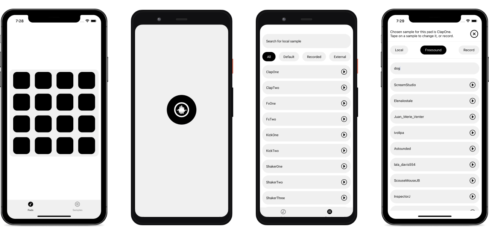

# Soundboard

Mobile application sampler made with `TypeScript`, `React Native`, and `Redux` as a school project, for my final year of [Bachelor in Computer Science](https://sciences.sorbonne-universite.fr/formation-sciences/licences/licences-professionnelles-l3/licence-professionnelle-metiers-de-0) at [Sorbonne Universié](https://www.sorbonne-universite.fr).

## Features

The application has two main scrrens:

- **Pads**: prints pads in a grid. A pad has a sound related to it, plays it when it's cliked. A long press on a pad opens a modal, which allows to edit it. We can choose a different song from some default ones, from [Fresound API](https://freesound.org), or record.
- **Samples**: shows all songs whe have in our library that we can use, sorted by `All`, `Default`, `Recorded` and `External` songs.

## Challenge

An optimized UI, instantaneous searches, organised code base with everything typed, a clean commit history, and many others :)
